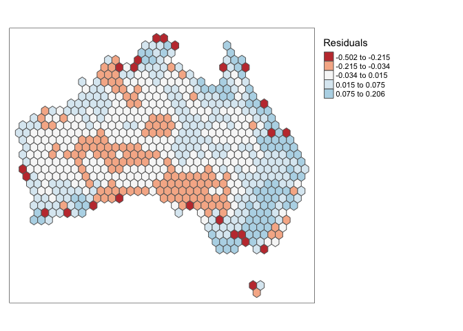

Geog6300: Lab 6
================

## Regression

``` r
library(sf)
library(tidyverse)
library(tmap)
library(ggplot2)
library(broom)
```

**Overview:** This lab focuses on regression techniques. You’ll be
analyzing the association of various physical and climatological
characteristics in Australia with observations of several animals
recorded on the citizen science app iNaturalist.

\###Data and research questions###

Let’s import the dataset.

``` r
lab6_data<-st_read("data/aus_climate_inat.gpkg")
```

    ## Reading layer `aus_climate_inat' from data source 
    ##   `/Users/atticustomcho/Desktop/Data Science Course/geog4300/Lab 6/data/aus_climate_inat.gpkg' 
    ##   using driver `GPKG'
    ## Simple feature collection with 716 features and 22 fields
    ## Geometry type: POLYGON
    ## Dimension:     XY
    ## Bounding box:  xmin: 113.875 ymin: -43.38632 xmax: 153.375 ymax: -11.92074
    ## Geodetic CRS:  WGS 84 (CRS84)

``` r
tm_shape(lab6_data)+tm_polygons("ndvi_20_med")
```

<!-- -->

The dataset for this lab is a 1 decimal degree hexagon grid that has
aggregate statistics for a number of variables:

- ndvi: NDVI/vegetation index values from Landsat data (via Google Earth
  Engine). These values range from -1 to 1, with higher values
  indicating more vegetation.
- maxtemp_00/20_med: Median maximum temperature (C) in 2000 or 2020
  (data from SILO/Queensland government)
- mintemp_00/20_med: Median minimum temperature (C) in 2020 or 2020
  (data from SILO/Queensland government)
- rain_00/20_sum: Total rainfall (mm) in 2000 or 2020 (data from
  SILO/Queensland government)
- pop_00/20: Total population in 2000 or 2020 (data from NASA’s Gridded
  Population of the World)
- water_00/20_pct: Percentage of land covered by water at some point
  during the year in 2000 or 2020
- elev_med: Median elevation (meters) (data from the Shuttle Radar
  Topography Mission/NASA)

There are also observation counts from iNaturalist for several
distinctively Australian animal species: the central bearded dragon, the
common emu, the red kangaroo, the agile wallaby, the laughing
kookaburra, the wombat, the koala, and the platypus.

Our primary research question is how the climatological/physical
variables in our dataset are predictive of the NDVI value. We will build
models for 2020 as well as the change from 2000 to 2020. The second is
referred to as a “first difference” model and can sometimes be more
useful for identifying causal mechanisms.

\###Part 1: Analysis of 2020 data###

We will start by looking at data for 2020.

**Question 1** *Create histograms for NDVI, max temp., min temp., rain,
and population, and water in 2020 as well as elevation. Based on these
graphs, assess the normality of these variables.*

``` r
variables <-c("ndvi_20_med", "maxtemp_20_med", "mintemp_20_med", "rain_20_sum", "pop_20", "water_20_pct", "elev_med")

for (var in variables) {
  hist(lab6_data[[var]], main = paste("Histogram of", var), xlab = var, col = "grey", breaks = 30)}
```

<!-- --><!-- --><!-- --><!-- --><!-- --><!-- --><!-- -->

{Visually, all of these graphs appear to be skewed and not normal.
Elevation is probably the closest to normal distribution. }

**Question 2** *Use tmap to map these same variables using Jenks natural
breaks as the classification method. For an extra challenge, use
`tmap_arrange` to plot all maps in a single figure.*

``` r
tmap_mode("plot")
```

    ## tmap mode set to plotting

``` r
tm_list <- lapply(variables, function(var) {
  tm_shape(lab6_data)+
    tm_polygons(var,style = "jenks", palette = "viridis", title = var)+
    tm_layout(legend.outside = TRUE)})

tmap_arrange(plotlist = tm_list)
```

    ## Legend labels were too wide. The labels have been resized to 0.31, 0.31, 0.31, 0.31, 0.31. Increase legend.width (argument of tm_layout) to make the legend wider and therefore the labels larger.

    ## Legend labels were too wide. The labels have been resized to 0.31, 0.31, 0.31, 0.31, 0.31. Increase legend.width (argument of tm_layout) to make the legend wider and therefore the labels larger.

    ## Legend labels were too wide. The labels have been resized to 0.41, 0.37, 0.37, 0.37, 0.37. Increase legend.width (argument of tm_layout) to make the legend wider and therefore the labels larger.

    ## Legend labels were too wide. The labels have been resized to 0.26, 0.25, 0.23, 0.23, 0.23. Increase legend.width (argument of tm_layout) to make the legend wider and therefore the labels larger.

    ## Legend labels were too wide. The labels have been resized to 0.39, 0.26, 0.25, 0.23, 0.23. Increase legend.width (argument of tm_layout) to make the legend wider and therefore the labels larger.

    ## Legend labels were too wide. The labels have been resized to 0.31, 0.31, 0.31, 0.31, 0.31. Increase legend.width (argument of tm_layout) to make the legend wider and therefore the labels larger.

    ## Legend labels were too wide. The labels have been resized to 0.43, 0.41, 0.41, 0.41, 0.35. Increase legend.width (argument of tm_layout) to make the legend wider and therefore the labels larger.

<!-- -->

**Question 3** *Based on the maps from question 3, summarise major
patterns you see in the spatial distribution of these data from any of
your variables of interest. How do they appear to be associated with the
NDVI variable?*

{The ndvi(vegetation) is highest around the edges of australia,
primarily on the southeast coast. This appears to have a similar pattern
as the rain map and population. The temperature has a distinct pattern
of warmer to colder from the north to south, respectively.}

**Question 4** *Create univariate models for each of the variables
listed in question 1, with NDVI in 2020 as the dependent variable. Print
a summary of each model. Write a summary of those results that indicates
the direction, magnitude, and significance for each model coefficient.*

``` r
result<-lapply(variables, function(var){
  model<-lm(ndvi_20_med ~ lab6_data [[var]], data = lab6_data)
  summary(model)})
```

    ## Warning in summary.lm(model): essentially perfect fit: summary may be
    ## unreliable

``` r
print(result)
```

    ## [[1]]
    ## 
    ## Call:
    ## lm(formula = ndvi_20_med ~ lab6_data[[var]], data = lab6_data)
    ## 
    ## Residuals:
    ##        Min         1Q     Median         3Q        Max 
    ## -1.503e-15  4.100e-19  2.580e-18  5.960e-18  6.764e-17 
    ## 
    ## Coefficients:
    ##                    Estimate Std. Error    t value Pr(>|t|)    
    ## (Intercept)      -1.765e-16  4.537e-18 -3.891e+01   <2e-16 ***
    ## lab6_data[[var]]  1.000e+00  1.513e-17  6.609e+16   <2e-16 ***
    ## ---
    ## Signif. codes:  0 '***' 0.001 '**' 0.01 '*' 0.05 '.' 0.1 ' ' 1
    ## 
    ## Residual standard error: 5.68e-17 on 714 degrees of freedom
    ## Multiple R-squared:      1,  Adjusted R-squared:      1 
    ## F-statistic: 4.368e+33 on 1 and 714 DF,  p-value: < 2.2e-16
    ## 
    ## 
    ## [[2]]
    ## 
    ## Call:
    ## lm(formula = ndvi_20_med ~ lab6_data[[var]], data = lab6_data)
    ## 
    ## Residuals:
    ##      Min       1Q   Median       3Q      Max 
    ## -0.41874 -0.07657 -0.01927  0.06833  0.36382 
    ## 
    ## Coefficients:
    ##                    Estimate Std. Error t value Pr(>|t|)    
    ## (Intercept)       0.6612389  0.0294372   22.46   <2e-16 ***
    ## lab6_data[[var]] -0.0130902  0.0009601  -13.63   <2e-16 ***
    ## ---
    ## Signif. codes:  0 '***' 0.001 '**' 0.01 '*' 0.05 '.' 0.1 ' ' 1
    ## 
    ## Residual standard error: 0.1251 on 714 degrees of freedom
    ## Multiple R-squared:  0.2066, Adjusted R-squared:  0.2055 
    ## F-statistic: 185.9 on 1 and 714 DF,  p-value: < 2.2e-16
    ## 
    ## 
    ## [[3]]
    ## 
    ## Call:
    ## lm(formula = ndvi_20_med ~ lab6_data[[var]], data = lab6_data)
    ## 
    ## Residuals:
    ##      Min       1Q   Median       3Q      Max 
    ## -0.36375 -0.08418 -0.03047  0.06972  0.40383 
    ## 
    ## Coefficients:
    ##                   Estimate Std. Error t value Pr(>|t|)    
    ## (Intercept)       0.464461   0.018997   24.45   <2e-16 ***
    ## lab6_data[[var]] -0.012282   0.001131  -10.86   <2e-16 ***
    ## ---
    ## Signif. codes:  0 '***' 0.001 '**' 0.01 '*' 0.05 '.' 0.1 ' ' 1
    ## 
    ## Residual standard error: 0.1301 on 714 degrees of freedom
    ## Multiple R-squared:  0.1418, Adjusted R-squared:  0.1406 
    ## F-statistic:   118 on 1 and 714 DF,  p-value: < 2.2e-16
    ## 
    ## 
    ## [[4]]
    ## 
    ## Call:
    ## lm(formula = ndvi_20_med ~ lab6_data[[var]], data = lab6_data)
    ## 
    ## Residuals:
    ##      Min       1Q   Median       3Q      Max 
    ## -0.56681 -0.04753 -0.01210  0.04599  0.30930 
    ## 
    ## Coefficients:
    ##                   Estimate Std. Error t value Pr(>|t|)    
    ## (Intercept)      1.303e-01  7.060e-03   18.45   <2e-16 ***
    ## lab6_data[[var]] 9.124e-07  3.953e-08   23.08   <2e-16 ***
    ## ---
    ## Signif. codes:  0 '***' 0.001 '**' 0.01 '*' 0.05 '.' 0.1 ' ' 1
    ## 
    ## Residual standard error: 0.1063 on 714 degrees of freedom
    ## Multiple R-squared:  0.4273, Adjusted R-squared:  0.4265 
    ## F-statistic: 532.6 on 1 and 714 DF,  p-value: < 2.2e-16
    ## 
    ## 
    ## [[5]]
    ## 
    ## Call:
    ## lm(formula = ndvi_20_med ~ lab6_data[[var]], data = lab6_data)
    ## 
    ## Residuals:
    ##      Min       1Q   Median       3Q      Max 
    ## -0.47003 -0.07883 -0.03949  0.06384  0.48974 
    ## 
    ## Coefficients:
    ##                   Estimate Std. Error t value Pr(>|t|)    
    ## (Intercept)      2.552e-01  5.013e-03  50.902   <2e-16 ***
    ## lab6_data[[var]] 1.500e-06  1.500e-07   9.998   <2e-16 ***
    ## ---
    ## Signif. codes:  0 '***' 0.001 '**' 0.01 '*' 0.05 '.' 0.1 ' ' 1
    ## 
    ## Residual standard error: 0.1316 on 714 degrees of freedom
    ## Multiple R-squared:  0.1228, Adjusted R-squared:  0.1216 
    ## F-statistic: 99.97 on 1 and 714 DF,  p-value: < 2.2e-16
    ## 
    ## 
    ## [[6]]
    ## 
    ## Call:
    ## lm(formula = ndvi_20_med ~ lab6_data[[var]], data = lab6_data)
    ## 
    ## Residuals:
    ##      Min       1Q   Median       3Q      Max 
    ## -0.26898 -0.08838 -0.04838  0.06871  0.50911 
    ## 
    ## Coefficients:
    ##                   Estimate Std. Error t value Pr(>|t|)    
    ## (Intercept)       0.268988   0.006287  42.781   <2e-16 ***
    ## lab6_data[[var]] -0.178263   0.154480  -1.154    0.249    
    ## ---
    ## Signif. codes:  0 '***' 0.001 '**' 0.01 '*' 0.05 '.' 0.1 ' ' 1
    ## 
    ## Residual standard error: 0.1403 on 714 degrees of freedom
    ## Multiple R-squared:  0.001862,   Adjusted R-squared:  0.0004636 
    ## F-statistic: 1.332 on 1 and 714 DF,  p-value: 0.2489
    ## 
    ## 
    ## [[7]]
    ## 
    ## Call:
    ## lm(formula = ndvi_20_med ~ lab6_data[[var]], data = lab6_data)
    ## 
    ## Residuals:
    ##      Min       1Q   Median       3Q      Max 
    ## -0.27082 -0.09585 -0.04270  0.07954  0.44272 
    ## 
    ## Coefficients:
    ##                   Estimate Std. Error t value Pr(>|t|)    
    ## (Intercept)      2.138e-01  9.741e-03  21.952  < 2e-16 ***
    ## lab6_data[[var]] 1.787e-04  2.895e-05   6.171 1.14e-09 ***
    ## ---
    ## Signif. codes:  0 '***' 0.001 '**' 0.01 '*' 0.05 '.' 0.1 ' ' 1
    ## 
    ## Residual standard error: 0.1369 on 714 degrees of freedom
    ## Multiple R-squared:  0.05064,    Adjusted R-squared:  0.04931 
    ## F-statistic: 38.08 on 1 and 714 DF,  p-value: 1.136e-09

{\*REVISED:  
2)Max temp:For one degree max temp increase, there is a slight negative
effect (-0.013) on the vegetation index. This was a signifcant value
(p\<0.0001) and the r-squared was 0.21. 3)Min temp:For one degree min
temp increase, there is also a similar slight negative effect (-0.012)
on the vegetation index. This was a significant value (p\<0.0001) and
the r-squared was 0.14. 4)Rainfall: As rain fall went up by 1mm, there
was a positive effect on vegetation index (9.12e-7). This was a
signifcant value (p\<0.0001) and the r-squared was 0.43 indicating a
relatively strong relationship. 5)Population:As population went up by
one, the vegetation index would increase by 1.5e-6. This was a
signifcant value (p\<0.0001) and the r-squared was 0.13. 6)% of land
covered by water: As percent of land covered by water went up by 1, the
vegetation index went down 0.18. This was not a signifcant result
(p\>0.05) adn the r-squared was minimal at 0.002. 7)Median elevation: As
median elevation went up by 1 meter, the vegation index increased by
1.787e-4. This was a signifcant value (p\<0.0001) and the r-squared was
small at 0.05.

\*original: All had significant findings except for water_20_pct (which
also had the lowest r squared value). rain_20_sum had the highest
r-squared value at 0.43. Max temp, mintemp, and water_pct have a
negative effect on vegetation. Rain, pop, and elevation had positive
effect on vegetation. }

**Question 5** *Create a multivariate regression model with the
variables of interest, choosing EITHER max or min temperature (but not
both) You may also choose to leave out any variables that were
insignificant in Q4. Use the univariate models as your guide. Call the
results.*

``` r
multi_reg_model<-lm(ndvi_20_med ~ maxtemp_20_med + rain_20_sum + pop_20 + elev_med,data = lab6_data)

summary(multi_reg_model)
```

    ## 
    ## Call:
    ## lm(formula = ndvi_20_med ~ maxtemp_20_med + rain_20_sum + pop_20 + 
    ##     elev_med, data = lab6_data)
    ## 
    ## Residuals:
    ##      Min       1Q   Median       3Q      Max 
    ## -0.50217 -0.02838  0.00409  0.03919  0.20570 
    ## 
    ## Coefficients:
    ##                  Estimate Std. Error t value Pr(>|t|)    
    ## (Intercept)     4.571e-01  2.194e-02  20.828  < 2e-16 ***
    ## maxtemp_20_med -1.170e-02  6.796e-04 -17.220  < 2e-16 ***
    ## rain_20_sum     8.469e-07  3.263e-08  25.953  < 2e-16 ***
    ## pop_20          2.862e-07  1.044e-07   2.741  0.00627 ** 
    ## elev_med        1.233e-04  1.796e-05   6.864 1.46e-11 ***
    ## ---
    ## Signif. codes:  0 '***' 0.001 '**' 0.01 '*' 0.05 '.' 0.1 ' ' 1
    ## 
    ## Residual standard error: 0.0845 on 711 degrees of freedom
    ## Multiple R-squared:  0.6397, Adjusted R-squared:  0.6376 
    ## F-statistic: 315.5 on 4 and 711 DF,  p-value: < 2.2e-16

**Question 6** *Summarize the results of the multivariate model. What
are the direction, magnitude, and significance of each coefficient? How
did it change from the univariate models you created in Q4 (if at all)?
What do the R2 and F-statistic values tell you about overall model fit?*

{\*REVISED: 1) Max temp: Signifcant (p\<0.05); As max temp increases 1,
vegetation index decreases by 1.1e-2. This is a smaller value than in
Q4. 2)Rainfall: Signifcant (p\<0.05); As rainfall increased by 1mm,
vegetation index increased by 8.46e-7. This is slightly smaller but
almost the exact same as Q4. 3)Population:Signifcant (p\<0.05); As
population increased by 1, vegetation index increased by 2.86e-7. This
decreased from Q4. 4)Median Elevation:Signifcant (p\<0.05); As median
elevation increased by 1 meter, vegetation index increased by 1.23e-4.
This is slightly smaller than Q4. The r-squared value of 0.64 shows that
this is a relatively strong relationship, compared to the individual
coefficients in Q4. The high f-statistic of 315.5 and p-value \< 2.2e-16
tells us this model is a good predictor of vegetation index.

\*original: All variables are statistically significant. maxtemp is the
only negative relationship. There is a relatively high r-squared value
of 0.64 which is much higher than any of the individual variables in q4.
The high r-squared and f-statistic values tell us that this is a good
overall model fit. }

**Question 7** *Use a histogram and a map to assess the normality of
residuals and any spatial autocorrelation. Summarise any notable
patterns that you see.*

``` r
lab6_data$residuals <-residuals(multi_reg_model)

residuals <- as.numeric(residuals(multi_reg_model))

hist(residuals, main = "Histogram of Residuals", xlab = "Residuals", col = "lightgrey",breaks = 30)
```

<!-- -->

``` r
tm_shape(lab6_data)+
  tm_polygons("residuals", style = "jenks", palette = "RdBu",  midpoint = 0, title = "Residuals") +
  tm_layout(legend.outside = TRUE)
```

<!-- -->

``` r
tmap_mode("view")
```

    ## tmap mode set to interactive viewing

{The residuals are relatively evenly spreadout throughout. The red
(lowest) residuals are found along the north and south coast, with few
on the east and west coast. The orange residuals seem to be clustered
around the middle region.}

**Question 8** *Assess any issues with multicollinearity or
heteroskedastity in this model using the techniques shown in class. Run
the appropriate tests and explain what their results show you.*

``` r
library(car)
```

    ## Loading required package: carData

    ## 
    ## Attaching package: 'car'

    ## The following object is masked from 'package:dplyr':
    ## 
    ##     recode

    ## The following object is masked from 'package:purrr':
    ## 
    ##     some

``` r
vif(multi_reg_model)
```

    ## maxtemp_20_med    rain_20_sum         pop_20       elev_med 
    ##       1.098705       1.078449       1.173863       1.009305

``` r
ncvTest(multi_reg_model)
```

    ## Non-constant Variance Score Test 
    ## Variance formula: ~ fitted.values 
    ## Chisquare = 287.6615, Df = 1, p = < 2.22e-16

{The vif values are from 1.009-1.17 indicating no multicollinearity. The
statisically significant pvalue indicates evidence of heterskedasity. }

**Question 9** *How would you summarise the results of this model in a
sentence or two? In addition, looking at the full model and your
diagnostics, do you feel this is a model that provides meaningful
results? Explain your answer.*

    {Maxtemp, rain, pop, and elevation have an effect on ndvi. I feel this model provides meaningful results due to the statistical significance and the relatively high r-squared value. However, the heteroskedacity means this model may need revisiting. }

**Disclosure of assistance:** *Besides class materials, what other
sources of assistance did you use while completing this lab? These can
include input from classmates, relevant material identified through web
searches (e.g., Stack Overflow), or assistance from ChatGPT or other AI
tools. How did these sources support your own learning in completing
this lab?*

{chatgpt helps me diagnose when an error occurs such as not having a
certain package running (library()). }

**Lab reflection:** *How do you feel about the work you did on this lab?
Was it easy, moderate, or hard? What were the biggest things you learned
by completing it?*

{I felt moderate about this lab. The class scripts and chatgpt helped
with completing code. The in class slides helped with interpreting
results. }

**Challenge question**

\#Option 1 Create a first difference model. To do that, subtract the
values in 2000 from the values in 2020 for each variable for which that
is appropriate. Then create a new model similar to the one you created
in question 5, but using these new variables showing the *change in
values* over time. Call the results of the model, and interpret the
results in the same ways you did above. Also chart and map the residuals
to assess model error. Finally, write a short section that summarises
what, if anything, this model tells you.

``` r
#chose option 2
```

\#Option 2 The animal data included in this dataset is an example of
count data, and usually we would use a Poisson or similar model for that
purpose. Let’s try it with regular OLS regression though. Create two
regression models to assess how the counts of two different animals
(say, koalas and emus) are associated with at least three of the
environmental/climatological variables given above. Be sure to use the
same independent variables in each model. Interpret the results of each
model and then explain the importance of any differences in the model
coefficients between them, focusing on direction, magnitude, and
significance.

``` r
koala_model<-lm(Koala ~ maxtemp_20_med + rain_20_sum +pop_20,data = lab6_data)

emu<-lm(Common.emu ~ maxtemp_20_med + rain_20_sum +pop_20,data = lab6_data)

summary(koala_model)
```

    ## 
    ## Call:
    ## lm(formula = Koala ~ maxtemp_20_med + rain_20_sum + pop_20, data = lab6_data)
    ## 
    ## Residuals:
    ##     Min      1Q  Median      3Q     Max 
    ## -1291.7    -5.2     6.5    13.8  6385.0 
    ## 
    ## Coefficients:
    ##                  Estimate Std. Error t value Pr(>|t|)    
    ## (Intercept)    -4.376e+01  6.388e+01  -0.685    0.493    
    ## maxtemp_20_med  7.580e-01  2.034e+00   0.373    0.710    
    ## rain_20_sum     9.630e-05  9.737e-05   0.989    0.323    
    ## pop_20          2.644e-03  3.124e-04   8.462   <2e-16 ***
    ## ---
    ## Signif. codes:  0 '***' 0.001 '**' 0.01 '*' 0.05 '.' 0.1 ' ' 1
    ## 
    ## Residual standard error: 252.9 on 712 degrees of freedom
    ## Multiple R-squared:  0.1098, Adjusted R-squared:  0.1061 
    ## F-statistic: 29.28 on 3 and 712 DF,  p-value: < 2.2e-16

``` r
summary(emu)
```

    ## 
    ## Call:
    ## lm(formula = Common.emu ~ maxtemp_20_med + rain_20_sum + pop_20, 
    ##     data = lab6_data)
    ## 
    ## Residuals:
    ##    Min     1Q Median     3Q    Max 
    ## -77.84 -10.25  -2.85   2.03 503.66 
    ## 
    ## Coefficients:
    ##                  Estimate Std. Error t value Pr(>|t|)    
    ## (Intercept)     7.182e+01  8.901e+00   8.069 3.02e-15 ***
    ## maxtemp_20_med -2.070e+00  2.834e-01  -7.304 7.52e-13 ***
    ## rain_20_sum     1.625e-06  1.357e-05   0.120  0.90470    
    ## pop_20          1.274e-04  4.353e-05   2.926  0.00354 ** 
    ## ---
    ## Signif. codes:  0 '***' 0.001 '**' 0.01 '*' 0.05 '.' 0.1 ' ' 1
    ## 
    ## Residual standard error: 35.25 on 712 degrees of freedom
    ## Multiple R-squared:  0.1048, Adjusted R-squared:  0.101 
    ## F-statistic: 27.78 on 3 and 712 DF,  p-value: < 2.2e-16

{For koala model, the r-squared is 0.11, with an f-statistic of 29.28,
and p-value\<0.0001 indicating a good overall fit. There is a positive
correlation between the three variables (max temp = 7.5e-1, rainfall =
9.6e-5, population = 2.6e-3). Only population has a statiscally
significant p-value (p\<0.0001).

For emu model, the f-statistic 27.78 and p-value \<0.0001 indicate a
good overall fit. Similar to koalas, the r-squared value was 0.10. Max
temp and population had signifcant p-values (p\<0.001). Max temp had a
negative correlation (-2.1) while the other two were positive (rainfall
= 1.6e-6, population = 1.27e-4).

Both animal models had similarly low R-squared values. Both animals had
a dependence on population (higher effect on koalas) but only emus had a
statisically signifcant relationship with max temp. Rainfall was not
statistically significant for either animal. }

library(knitr)
